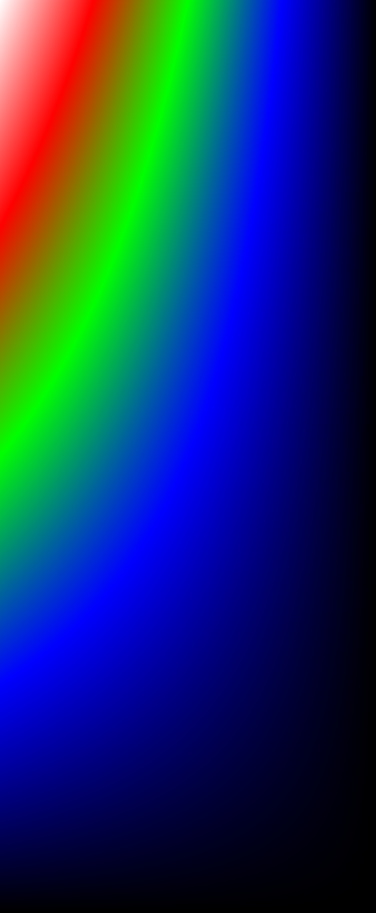
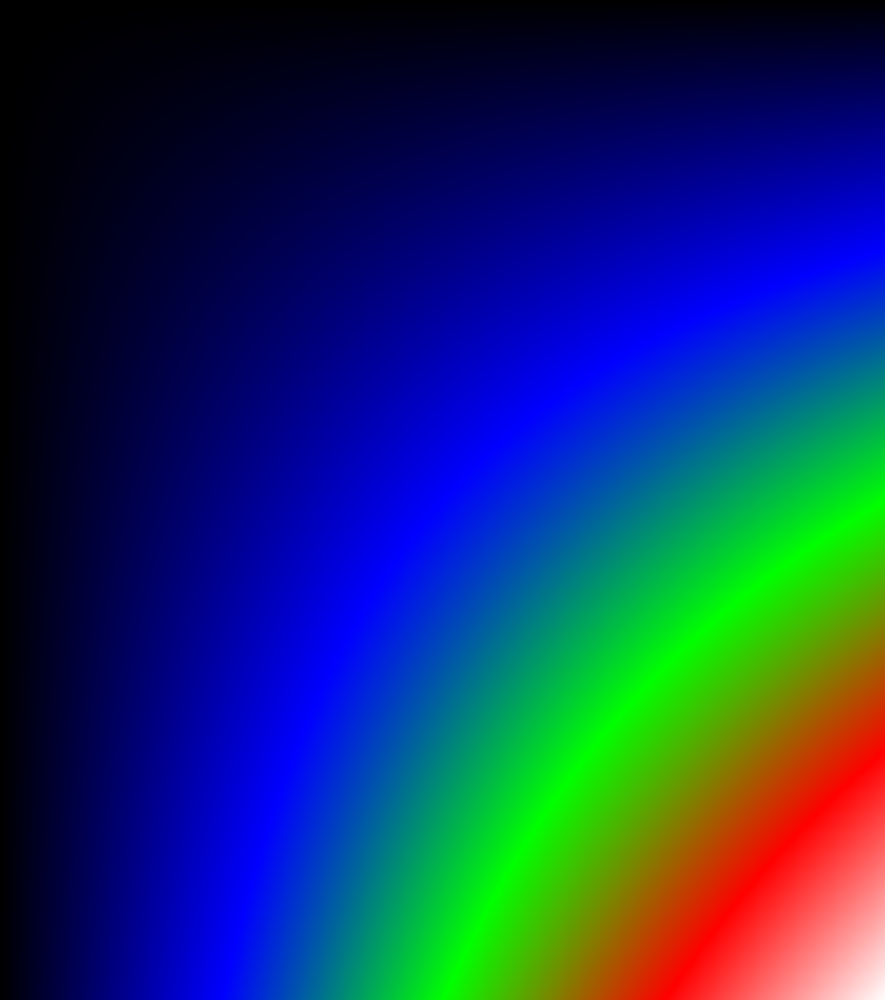
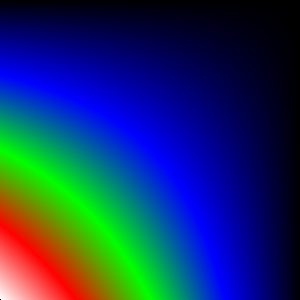
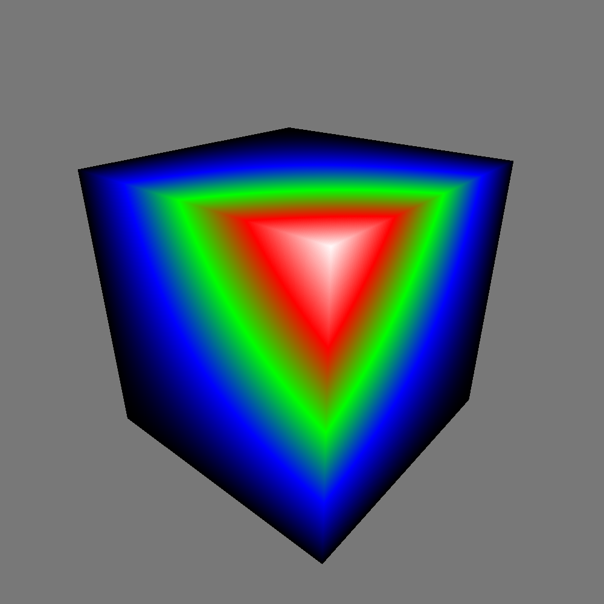

# 3D Work

A crucial problem with the Cuboid rendering right now is the spacial changes between a block and the simulation

The space assumed by the 3D_slice_tracker is assumed such that by decreasing X, Y and Z,
this translates to moving left, down and backward in 3D space

BMP files are a little different - the image assumes a decreasing X, Y and Z translates to moving left, up and backward

## Current Situation

An `I x J x K` block has been generated like this:
```cpp
  auto rand_device = std::random_device{};
  auto rand_gen = std::mt19937{rand_device()};
  auto rand_distribution = std::uniform_int_distribution<std::size_t>(1, 2000);

  std::vector<double> data;
  std::array<std::size_t, 3> dims = {rand_distribution(rand_gen),
                                     rand_distribution(rand_gen),
                                     rand_distribution(rand_gen)};

  for (int z = dims[2]; z > 0; z--) {
    for (int y = 0; y < dims[1]; y++) {
      for (int x = 0; x < dims[0]; x++) {
        data.push_back(static_cast<double>(x * y * z));
      }
    }
  }
```

This means that, from the default camera perspective, the hot spot area should be the nearest top corner


### Slices

For clarification, an '[AXIS] Slice' means that for every point in the slice, the [AXIS] coefficient will be the same

| X Slice | Y Slice | Z Slice|
|----------|----------|----------|
|  |  |  |

### Current 3D Cuboid Render



## Other Issues

You would want to view your block from different perspectives, and these would *have* to shift the different faces
